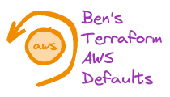

<br/>
<p align="center">
  <a href="https://github.com/bendoerr/terraform-aws-defaults">
    <picture>
      <source media="(prefers-color-scheme: dark)" srcset="docs/logo-dark.png">
      
    </picture>
  </a>

<h3 align="center">Ben's Terraform AWS Defaults Module</h3>

  <p align="center">
    This is how I do it.
    <br/>
    <br/>
    <a href="https://github.com/bendoerr/terraform-aws-defaults"><strong>Explore the docs »</strong></a>
    <br/>
    <br/>
    <a href="https://github.com/bendoerr/terraform-aws-defaults/issues">Report Bug</a>
    .
    <a href="https://github.com/bendoerr/terraform-aws-defaults/issues">Request Feature</a>
  </p>
</p>

 

## About The Project

My opinionated AWS Defaults module.

## Usage

```
module "context" {
  source    = "git@github.com:bendoerr/terraform-null-context?ref=v0.3.0"
  namespace = "brd"
  role      = "production'
  region    = "us-east-1"
  project   = "example'
}

module "aws_defaults" {
  source               = "git@github.com:bendoerr/terraform-aws-defaults?ref=v0.1.0"
  context              = module.context.shared
  budget_monthly_limit = 10
  budget_alert_emails  = "alerts@example.com"
}
```

## Requirements

| Name | Version |
|------|---------|
| <a name="requirement_terraform"></a> [terraform](#requirement\_terraform) | >= 0.13 |

## Providers

| Name | Version |
|------|---------|
| <a name="provider_aws"></a> [aws](#provider\_aws) | n/a |

## Modules

| Name | Source | Version |
|------|--------|---------|
| <a name="module_label_monthly_total"></a> [label\_monthly\_total](#module\_label\_monthly\_total) | git@github.com:bendoerr/terraform-null-label | v0.3.0 |

## Resources

| Name | Type |
|------|------|
| [aws_budgets_budget.monthly_total](https://registry.terraform.io/providers/hashicorp/aws/latest/docs/resources/budgets_budget) | resource |
| [aws_ebs_default_kms_key.default](https://registry.terraform.io/providers/hashicorp/aws/latest/docs/resources/ebs_default_kms_key) | resource |
| [aws_ebs_encryption_by_default.default](https://registry.terraform.io/providers/hashicorp/aws/latest/docs/resources/ebs_encryption_by_default) | resource |
| [aws_ec2_serial_console_access.default](https://registry.terraform.io/providers/hashicorp/aws/latest/docs/resources/ec2_serial_console_access) | resource |
| [aws_ecs_account_setting_default.awsvpc_trunking](https://registry.terraform.io/providers/hashicorp/aws/latest/docs/resources/ecs_account_setting_default) | resource |
| [aws_ecs_account_setting_default.container_insights](https://registry.terraform.io/providers/hashicorp/aws/latest/docs/resources/ecs_account_setting_default) | resource |
| [aws_kms_alias.ebs](https://registry.terraform.io/providers/hashicorp/aws/latest/docs/data-sources/kms_alias) | data source |

## Inputs

| Name | Description | Type | Default | Required |
|------|-------------|------|---------|:--------:|
| <a name="input_budget_alert_emails"></a> [budget\_alert\_emails](#input\_budget\_alert\_emails) | n/a | `string` | n/a | yes |
| <a name="input_budget_monthly_limit"></a> [budget\_monthly\_limit](#input\_budget\_monthly\_limit) | n/a | `string` | n/a | yes |
| <a name="input_context"></a> [context](#input\_context) | Shared Context from Ben's terraform-null-context | <pre>object({<br>    attributes     = list(string)<br>    dns_namespace  = string<br>    environment    = string<br>    instance       = string<br>    instance_short = string<br>    namespace      = string<br>    region         = string<br>    region_short   = string<br>    role           = string<br>    role_short     = string<br>    project        = string<br>    tags           = map(string)<br>  })</pre> | n/a | yes |

## Outputs

No outputs.


## Roadmap

See the [open issues](https://github.com/bendoerr/terraform-aws-defaults/issues) for a list of proposed features (and known issues).

## Contributing

Contributions are what make the open source community such an amazing place to be learn, inspire, and create. Any contributions you make are **greatly appreciated**.
* If you have suggestions for adding or removing projects, feel free to [open an issue](https://github.com/bendoerr/terraform-aws-defaults/issues/new) to discuss it, or directly create a pull request after you edit the *README.md* file with necessary changes.
* Please make sure you check your spelling and grammar.
* Create individual PR for each suggestion.

### Creating A Pull Request

1. Fork the Project
2. Create your Feature Branch (`git checkout -b feature/AmazingFeature`)
3. Commit your Changes (`git commit -m 'Add some AmazingFeature'`)
4. Push to the Branch (`git push origin feature/AmazingFeature`)
5. Open a Pull Request

## License

Distributed under the MIT License. See [LICENSE](https://github.com/bendoerr/terraform-aws-defaults/blob/main/LICENSE.txt) for more information.

## Authors

* **Benjamin R. Doerr** - *Terraformer* - [Benjamin R. Doerr](https://github.com/bendoerr/) - *Built Ben's Terraform Modules*

## Acknowledgements

* [ShaanCoding (ReadME Generator)](https://github.com/ShaanCoding/ReadME-Generator)
